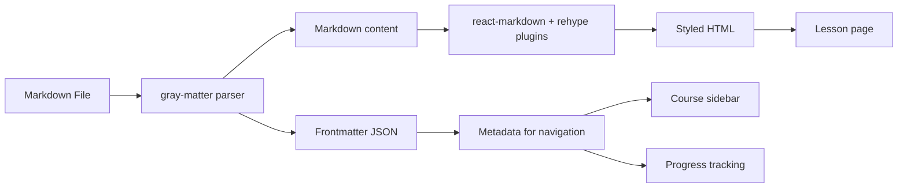

# Content Strategy — Markdown Curriculum Architecture

> **Inspired by The Odin Project. Built for 100xSystems.**

---

## 1. Content Directory Structure

All curriculum content lives under `/content/` at the project root:

```
content/
├── paths/                          # Top-level learning paths
│   ├── java/                       # Java path
│   │   ├── meta.yml                # Path metadata
│   │   ├── 01-foundations/         # Course 1: Foundations
│   │   │   ├── meta.yml            # Course metadata
│   │   │   ├── 01-what-is-java/    # Lesson 1
│   │   │   │   ├── index.md        # Lesson content
│   │   │   │   └── images/         # Lesson-specific images
│   │   │   │       ├── java-logo.png
│   │   │   │       └── jvm-architecture.svg
│   │   │   ├── 02-setup/           # Lesson 2
│   │   │   ├── ...                 # More lessons
│   │   │   └── project-calculator/ # End-of-course project
│   │   │       ├── index.md        # Project brief
│   │   │       └── images/
│   │   ├── 02-core-concepts/       # Course 2
│   │   └── ...
│   ├── javascript/
│   ├── python/
│   └── go/
├── projects/                       # Shared projects (Build your own X)
│   ├── build-your-own-git/
│   ├── build-your-own-redis/
│   └── ...
└── shared/
    └── images/                     # Shared images used across paths
```

## 2. File Formats

### Path Metadata (`meta.yml`)

```yaml
title: Java Programming
description: >
  Learn Java from absolute zero to building production-ready systems.
  This path covers everything from syntax fundamentals to advanced
  concurrency, networking, and system design with Java.
order: 1
difficulty: beginner
estimated_hours: 200
icon: java
prerequisites: none
projects:
  - calculator
  - banking-system
  - chat-application
  - build-your-own-jvm
```

### Course Metadata (`meta.yml`)

```yaml
title: Java Foundations
description: >
  Set up your development environment and learn the absolute basics
  of Java programming — variables, types, control flow, and functions.
order: 1
estimated_hours: 25
lessons:
  - 01-what-is-java
  - 02-setup
  - 03-hello-world
  - 04-variables-and-types
  - 05-control-flow
  - 06-functions
```

### Lesson Content (`index.md`)

```markdown
---
title: What is Java?
description: Understand what Java is, why it exists, and how it powers millions of applications worldwide.
order: 1
estimated_minutes: 20
---

# What is Java?

Java is a **programming language** and **computing platform** first released by Sun Microsystems in 1995...

## Why Java?

- **Write Once, Run Anywhere**: Java code compiles to bytecode that runs on any JVM...
- **Industry Standard**: Used by 90% of Fortune 500 companies...
- **Statically Typed**: Catches errors at compile time...

## How Java Works


When you write Java code...

## Knowledge Check

- [x] What does "Write Once, Run Anywhere" mean?
- [ ] What is the JVM and what does it do?
- [ ] How is Java different from JavaScript?
- [ ] What companies use Java in production?

## Additional Resources

- [Oracle Java Documentation](https://docs.oracle.com/javase/tutorial/)
- [Wikipedia: Java](https://en.wikipedia.org/wiki/Java_(programming_language))
```

## 3. Frontmatter Schema

Every lesson markdown file MUST have YAML frontmatter:

```typescript
interface LessonFrontmatter {
  title: string;              // Lesson title
  description: string;        // One-paragraph description
  order: number;              // Position in the course
  estimated_minutes: number;  // Estimated reading time
  knowledge_checks?: string[]; // List of review questions
  resources?: {              // Optional external resources
    title: string;
    url: string;
    type: 'article' | 'video' | 'documentation' | 'tool';
  }[];
}
```

## 4. Image Strategy

Images must be:
1. **Co-located** with their markdown files (in an `images/` subdirectory)
2. **Referenced via relative paths** — not absolute URLs
3. **Optimized** — compressed, WebP format preferred
4. **Lightweight** — prefer SVGs for diagrams, compressed JPEGs/WebP for photos

```
01-what-is-java/
├── index.md
└── images/
    ├── java-logo.webp
    ├── jvm-architecture.svg
    └── compilation-process.webp
```

## 5. Rendering Pipeline



## 6. Content Organization Rules

### Rule 1: One Concept Per Lesson
- Each lesson covers ONE core concept
- If a concept takes >30 min to read, split it
- Shorter lessons = better retention

### Rule 2: Projects Break Up Theory
- Every 3-5 lessons should have a project
- Projects solidify learning before moving on
- Projects can be small (1-2 hours) or large (10+ hours)

### Rule 3: Knowledge Checks Are Mandatory
- Every lesson ends with 3-5 questions
- Questions test understanding, not memorization
- Answers are checked against the lesson content

### Rule 4: External Resources Supplement, Don't Replace
- Link to best external resources
- But the core explanation must be self-contained
- External resources are for deeper dives

## 7. Path Structure (Odin Project Model)

Each Path = complete curriculum for one language/domain:

```
Path (e.g., "Java Programming")
├── Course 1: Foundations (lessons + 1 project)
├── Course 2: Core Concepts (lessons + 2 projects)
├── Course 3: Advanced (lessons + 2 projects)
├── Course 4: Systems Integration (lessons + 1 capstone project)
└── Course 5: Build Your Own X (1 large project)
```
