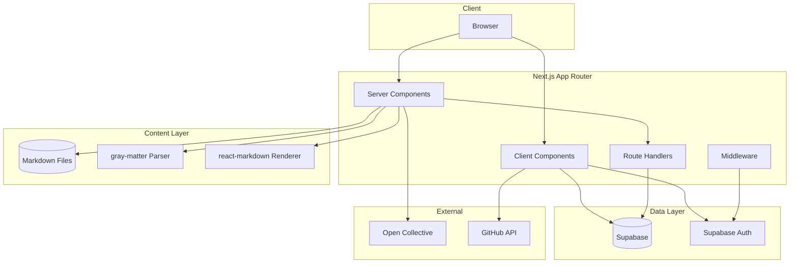

# Technical Architecture — 100xSystems

## Stack Overview

```
Frontend:  Next.js 16 (App Router) + React 19
Styling:   Tailwind CSS + CSS Modules (migrating to Tailwind)
Content:   Markdown (gray-matter + react-markdown)
Database:  Supabase (community features only, NOT content)
Auth:      Supabase Auth (Google OAuth, GitHub OAuth)
Deploy:    Vercel
Analytics: Supabase (for donation analytics, user metrics)
Donations: Open Collective
```

## Architecture Diagram



## Key Architectural Decisions

### 1. Content Is File-Based

**Decision**: All curriculum content lives as markdown files in `/content/` at the project root.

**Why**: 
- Version control = content history
- PR-based contributions = quality control
- No database dependency for content rendering
- Simple, transparent, easy to edit
- Works offline

**Trade-off**: Content updates require a deployment. Mitigated by:
- Fast builds with ISR (Incremental Static Regeneration)
- Preview environments for content review
- Automated builds on merge to main

### 2. Supabase Is For Community, Not Content

**Decision**: Supabase handles auth, user profiles, project submissions, and community features. Content rendering reads from files.

**Why**:
- Clear separation of concerns
- Content can be developed independently
- No database read costs for content delivery
- Easier to contribute (just edit a markdown file)

### 3. Server Components By Default

**Decision**: Use React Server Components for content rendering. Client components only for interactivity.

**Why**:
- Smaller JS bundle (content components don't ship to client)
- Faster page loads
- Better SEO (content is rendered on server by default)
- Streaming support for progressive rendering

### 4. Minimal State Management

**Decision**: No global state library. Use URL state, search params, and React Server Component patterns.

**Why**:
- Most page state is serializable to URLs
- Server-rendered pages don't need client state
- Reduces complexity and bundle size
- Better UX (shareable URLs, browser back/forward works)

## Data Flow

### Content Request Flow

```
1. User navigates to /paths/java/01-foundations/01-what-is-java
2. App Router dynamic segment resolves [...slug]
3. Server Component reads markdown file from /content/
4. gray-matter parses YAML frontmatter + content body
5. react-markdown renders content to HTML
6. Knowledge checks extracted from frontmatter
7. Navigation sidebar built from directory structure
8. Page is streamed or served as static HTML
```

### Project Submission Flow

```
1. User completes project, pushes to GitHub
2. User submits GitHub URL + live URL via form
3. Client Component calls API route
4. API route validates + stores in Supabase
5. Project appears in gallery
6. Other users can view, upvote, comment
```

## Folder Structure (Post-Migration)

```
100xsystems/
├── content/                    # Curriculum content (markdown)
├── public/                     # Static assets
│   └── assets/
│       ├── images/
│       └── illustrations/
├── src/
│   ├── app/                    # App Router pages
│   │   ├── layout.tsx
│   │   ├── page.tsx
│   │   ├── about/
│   │   ├── articles/
│   │   ├── paths/
│   │   └── api/
│   ├── presentation/           # UI components
│   │   ├── __components/       # NEW design system
│   │   ├── _components/        # Legacy components
│   │   ├── _storybook/         # Storybook stories
│   │   ├── _styles/            # Styles
│   │   └── features/           # Feature components
│   ├── application/            # Business logic
│   │   ├── hooks/
│   │   ├── services/
│   │   ├── types/
│   │   └── lib/
│   └── infrastructure/         # External services
│       ├── supabase.ts
│       └── services/
├── docs/                       # Documentation
├── supabase/                   # Database migrations
├── package.json
├── next.config.ts
└── tsconfig.json
```

## Performance Targets

| Metric | Target |
|--------|--------|
| LCP (Largest Contentful Paint) | < 2.0s |
| FCP (First Contentful Paint) | < 1.0s |
| TTI (Time to Interactive) | < 2.5s |
| TBT (Total Blocking Time) | < 100ms |
| CLS (Cumulative Layout Shift) | < 0.1 |
| Bundle size (first load JS) | < 100KB |
| Lighthouse Performance | > 90 |
| Lighthouse Accessibility | > 95 |

## SEO Strategy

1. **Static Generation**: Content pages are statically generated at build time
2. **ISR**: Content pages revalidate on demand via webhook
3. **Metadata**: Every page has unique title, description, and Open Graph tags
4. **Sitemap**: Auto-generated from content directory structure
5. **RSS Feed**: For articles and blog posts
6. **Structured Data**: JSON-LD for courses, lessons, and organization
