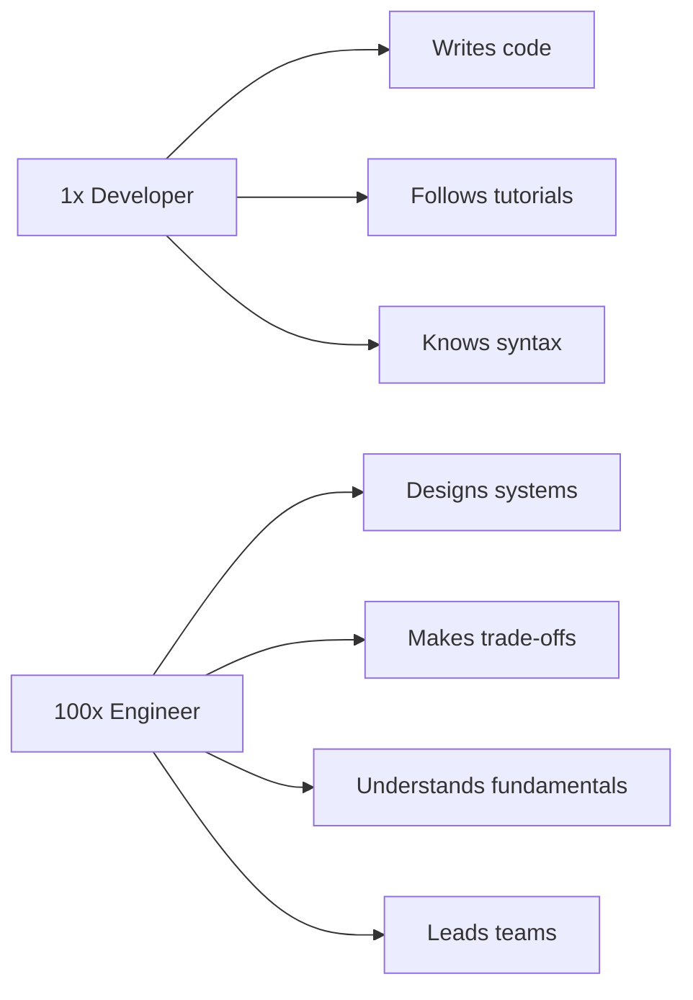

# The 100xSystems Vision

> **"Master Rubik's Cube of Software Engineering"**

This document captures the founder's vision — not as a rigid plan, but as a living philosophy that guides every decision.

---

## The Core Insight

Software engineering is like a Rubik's Cube:
- It appears simple but contains immense complexity
- There are patterns — once you learn the patterns, you can solve any configuration
- Layer by layer, the complexity becomes manageable
- The patterns REPEAT across domains

**100xSystems teaches the patterns, not just the moves.**

---

## The Problem We Solve

> _"Imagine you are a college student who knows nothing about programming. You hop from one website to another, trying to find resources. You ask AI to learn, but AI tells you what you want to hear, not what is correct. You are innocent, and we must bring you out of that innocence."_

### The Three Challenges of Engineering Education

1. **Information Overload**: Too many tutorials, too many opinions, too many frameworks
2. **AI Hallucination**: LLMs give confident but incorrect answers
3. **No Structure**: Scattered knowledge without a coherent path

### Our Solution

A **curated, open-source, depth-first curriculum** that:
- Walks students step by step
- Covers fundamentals that never become obsolete
- Integrates system thinking into EVERY course
- Is maintained by community contributions

---

## The Business Model

> _"I want to give so much value that people rely on me and give donations."_

| Approach | Implementation |
|----------|---------------|
| **Free forever** | No paywalls, no freemium tiers |
| **Donation-funded** | Open Collective |
| **Open source** | Both curriculum AND platform code |
| **Community-driven** | Contributors improve content |
| **Organic growth** | Word of mouth, quality content |

**Monetization is NOT the goal. Value creation IS.**

Future optional models (only if needed):
- Mentor marketplace (connect students with experts)
- Template system (reusable project templates)
- Corporate sponsorships

---

## Content Philosophy

### What Makes Our Content Different

1. **Depth, not breadth**: Master one language completely before moving on
2. **Systems thinking in every course**: Even Java 101 teaches system architecture
3. **Curated, not created from scratch**: Link to the best resources + add our own depth
4. **Living content**: Easily updatable via markdown + community PRs
5. **No video**: Text-based content that's searchable, versionable, and accessible

### The Chapter Structure

Every chapter follows this structure:
1. **Learning objectives** (what you'll learn)
2. **The lesson** (markdown content with code examples)
3. **Knowledge check** (3-5 questions to verify understanding)
4. **Additional resources** (curated links for deeper dives)
5. **Assignment** (if applicable — a small exercise)

### The Project Structure

Projects break the monotony of lessons and build portfolio:
1. **Project brief** (what to build)
2. **Requirements** (specific acceptance criteria)
3. **Hints** (if stuck, here's help)
4. **Submission** (link to GitHub repo + live URL)
5. **Gallery** (see others' solutions)

---

## What "100x" Really Means

The "100x" in our name refers to:

It's NOT about being 100x faster at typing. It's about being 100x more effective through **systems thinking**.

---

## The Slogan

> **"Master Rubik's Cube of Software Engineering"**

This is more than marketing — it's the core analogy that drives our teaching methodology. Every technology has patterns. Once you see the patterns in one domain, they appear everywhere.

---

## Design Principles

1. **Content is the product** — everything else is packaging
2. **Simple is hard** — stripping features takes more discipline than adding them
3. **Depth is the moat** — shallow content is everywhere; depth is rare
4. **Community is oxygen** — without contributors and learners, the platform dies
5. **Open source is non-negotiable** — trust is built through transparency

---

## The Long Game

| Timeframe | Goal |
|-----------|------|
| 3 months | One complete language curriculum (Java) with projects |
| 6 months | 3 language curricula, active community, donations flowing |
| 1 year | 10+ languages, "Build your own X" integrated projects, 10k+ learners |
| 3 years | The go-to platform for self-taught engineers worldwide |
| 5 years | AI-assisted personalized learning paths on top of the content |
